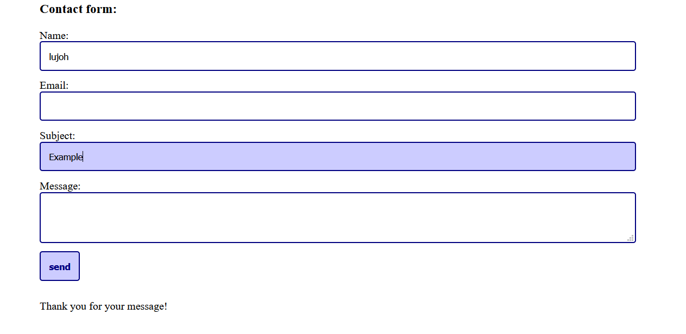
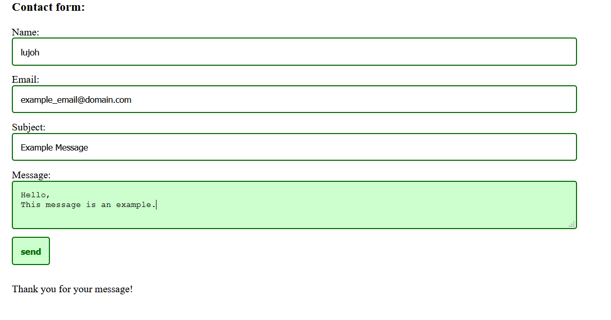
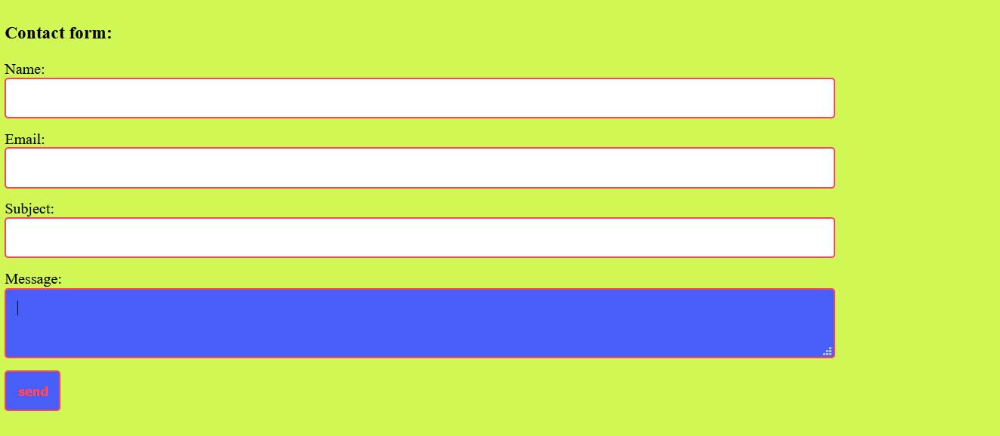

# contact-form-php
working contact form with server side validation - made with PHP


## Description
This project is a working contact form that can be inserted into any website that uses php. It contains the fields "name" "email" "subject" and "message".

The form will be able to be customized. The minimum customization that needs to be done is adding the email address at which the website owner wants to receive messages at.

## Use Instructions
To use this contact form in your own website you first need to download the folder contact_form_files

To customize the form you can edit the file _owner_settings_contact_form . Instructions are given in the file on what you can change. The minimum change you have to do is add the email address where you want to receive emails.

To add the contact form to your page you need to add the style sheet by pasting this link in the head of your page
```
<link rel="stylesheet" type="text/css" href="contact_form_files\contact_form_style.php">
```

Then you can add the contact form in the place where you want it on your page by pasting the following in the place where you want the contact form to appear
```
<?php 
    require_once "contact_form_files\contact_form.php";
?>
 ```
 
 To make sure the contact form works, make sure that you are inserting it into a file with a .php ending, that you are using a server that processes PHP and that your server is configured to send emails.
 
 For an explanation on how to configure your local server to send emails if you are using XAMPP and gmail click [here](https://meetanshi.com/blog/send-mail-from-localhost-xampp-using-gmail/)

## Background
I made this contact form as an exercise to practice Object Oriented Programming. I was trying to rewrite the concepts that I used in the contact form for [Christian's website](https://github.com/lujoh/Website-Christian-Hackbarth-Johnson/blob/main/Kontaktform.php)
using Object Oriented methods

## Technologies Used
- PHP
- HTML
- CSS

## What it looks like
The blue is the default coloring:



And this is an example with the colors changed to green:



And lastly an example with random colors to show how much damage you can do:
